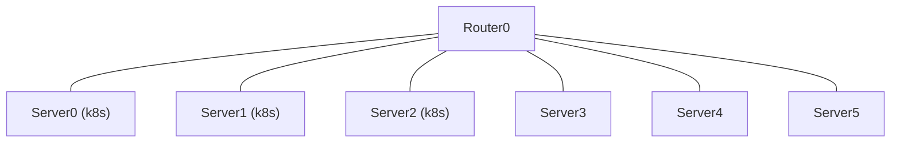

# Using k8s Pod as a forwarding function (LB, NAT, VPN-GW, etc...)

What could go wrong?

## Topology

## How to use `make`

- Create Lab: `make deploy`
- Destroy Lab: `make destroy`
- Recreate Lab: `make redeploy`
